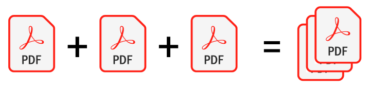

<p align="center">

</p>

# Magic-PDF-Joiner
Program for joining all PDF's in current directory

## Author
* Martin Maasik (2021)

## License
* Freeware GNUv2: https://www.gnu.org/licenses/old-licenses/gpl-2.0.html

## Features
* Doubleclick on 'Magic PDF Joiner.exe'
* All PDF's in current directory will be joined
* And saved in 'Magic PDF/Magic PDF Joiner Result.pdf'

# Version history:

## V.2021.02.16
* Ignoring directories in working folder
* If no PDF's in working directory, then nothing will be written
* Added file description to executable('version.rc')
* Commented code line-by-line

## V.2021.02.15
* Removed 'xref table not zero-indexed' error by adding strict=False
```
merger = PdfFileMerger(strict=False)
```

## V.2021.02.12
* Initial version

## To create executable with heart icon('magic.ico'):
* pip install pyinstaller
* pyinstaller -F -i "magic.ico" -n Magic_PDF_Joiner --version-file=.\version.rc Magic.py
